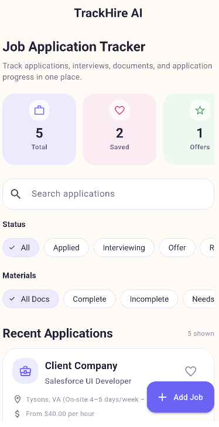
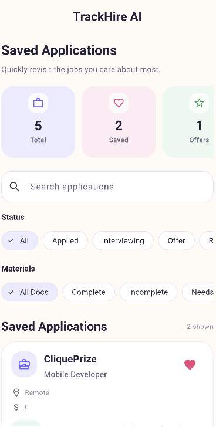
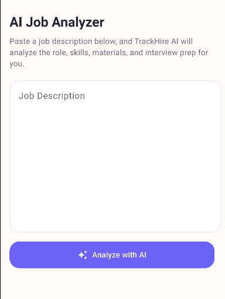
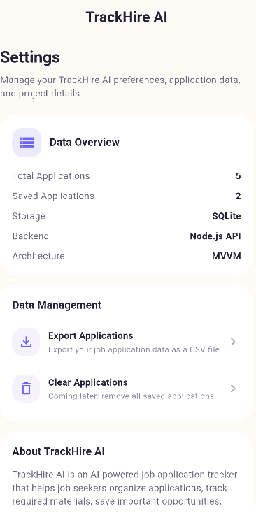

# TrackHire AI


TrackHire AI is a full-stack Flutter mobile career management app that helps job seekers track applications, analyze job descriptions, generate resume bullet ideas, manage required materials, and save structured insights in one clean mobile workspace.

## Project Status

TrackHire AI is an active personal project. The current version supports full job tracking, backend persistence, AI-inspired job analysis, resume bullet generation, CSV export, Android APK builds, iOS Simulator testing, and GitHub Actions CI.

TestFlight deployment is planned for a future release.

## Product Overview

Job searching can get messy fast. Applicants often track roles across spreadsheets, notes apps, emails, and job boards, making it difficult to stay organized.

TrackHire AI solves this by giving users a structured mobile workflow for managing job applications, including company details, role information, application status, salary range, location, notes, saved jobs, and required application materials.

The app started as a local Flutter application and later expanded into a backend-connected mobile platform with Provider state management, an MVVM-inspired workflow, a dedicated API service layer, a Node.js/Express REST API, SQLite persistence, CSV export support, and GitHub Actions CI. The current README also documents Android/iOS testing and demo build plans. :contentReference[oaicite:0]{index=0}

## Product Goals

- Simplify job application tracking through a clean mobile interface
- Help users organize applications, materials, notes, and saved roles
- Analyze job descriptions and extract useful role insights
- Generate resume bullet ideas and interview preparation prompts
- Save AI-generated insights directly into real application records
- Demonstrate full-stack mobile development with clean architecture

## Screenshots

### Home Screen



### Saved Applications



### AI Job Analyzer



### Settings



## Try It

Android demo APK is available in the GitHub Releases section.

TrackHire AI has also been tested on iOS Simulator. TestFlight deployment is planned for a future release.

## Platform Testing

TrackHire AI has been tested on both Android Emulator and iOS Simulator.

The API service automatically switches backend URLs depending on platform:

- Android Emulator: `http://10.0.2.2:3000`
- iOS Simulator: `http://localhost:3000`

## Demo

A short demo video/GIF will be added here to show:

1. Tracking job applications
2. Analyzing a job description
3. Generating resume bullet ideas
4. Saving AI insights into TrackHire

## Features

- Add, edit, delete, and view job applications
- Track application status: Applied, Interviewing, Offer, or Rejected
- Save important applications to a dedicated Saved page
- Search applications by company, role, location, salary, or notes
- Filter applications by status and required materials
- Track materials such as resume, portfolio, cover letter, application questions, and other documents
- View dashboard stats for total applications, saved jobs, offers, interviews, and rejections
- Analyze pasted job descriptions with an AI-inspired job analyzer
- Extract role title, company, location, salary range, required skills, preferred skills, and recommended materials
- Generate role summaries and tailored interview preparation questions
- Generate resume bullet ideas based on job-description keywords
- Save AI-generated job analysis and resume bullets directly as a TrackHire application
- Export job application data as a CSV file
- Share exported CSV files through the native mobile share sheet
- Connect the Flutter app to a Node.js/Express REST API
- Persist backend data using SQLite
- Handle API connection errors with a user-friendly error state
- Use a clean Material 3 UI with pastel dashboard cards and responsive mobile layouts
- Organize code with models, views, widgets, providers, viewmodels, services, database, and backend layers
- Validate code quality through GitHub Actions CI for formatting, static analysis, testing, and Android debug APK builds

## Tech Stack

### Frontend

- Flutter
- Dart
- Provider
- Material 3
- http
- csv
- share_plus
- path_provider

### Backend

- Node.js
- Express
- SQLite
- CORS
- REST API
- JSON request and response handling
- Persistent backend storage

### Architecture and State Management

- Provider state management
- MVVM-inspired AI workflow
- Dedicated model layer
- Dedicated service layer
- Dedicated viewmodel layer
- Reusable widget components
- JSON serialization
- Separation of UI, business logic, API logic, and data models

### AI-Inspired Features

- Job description analysis
- Structured role insight extraction
- Required and preferred skill detection
- Recommended materials generation
- Interview question generation
- Resume bullet idea generation
- Save AI analysis into the application workflow

### Local Data and App Services

- SQLite with sqflite
- Local model serialization
- CSV export service
- Native share-sheet integration

### Development Tools

- Git
- GitHub
- GitHub Actions CI/CD
- Android Studio
- Xcode
- Dart Format
- Flutter Analyze
- Flutter Test
- Android debug APK builds
- iOS Simulator testing

## Architecture

```txt
Flutter UI
  ↓
Provider State Management
  ↓
ViewModel Layer
  ↓
Service Layer
  ↓
ApiService / AIService
  ↓
Node.js / Express REST API
  ↓
SQLite Backend Database